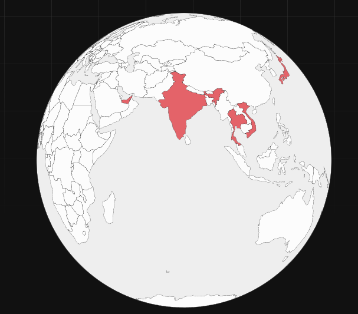

# World-GeoJson-India-Political
World mini GeoJSON more aligned with the Political Map of India and it's boundaries. 
This is ofcourse not a mini GeoJSON and not a full accuracy maps, skips a lot of islands, smaller in size quicker and easeir to use, especially on the web.

Example:
as used on my personal website : [https://siddharthshetty.in/travel](https://siddharthshetty.in/travel)

## License
This dataset is licensed under the Creative Commons Attribution 4.0 International (CC BY 4.0).  
© 2025 Siddharth Shetty. Please attribute with: "GeoJSON data by Siddharth Shetty, licensed under CC BY 4.0".

